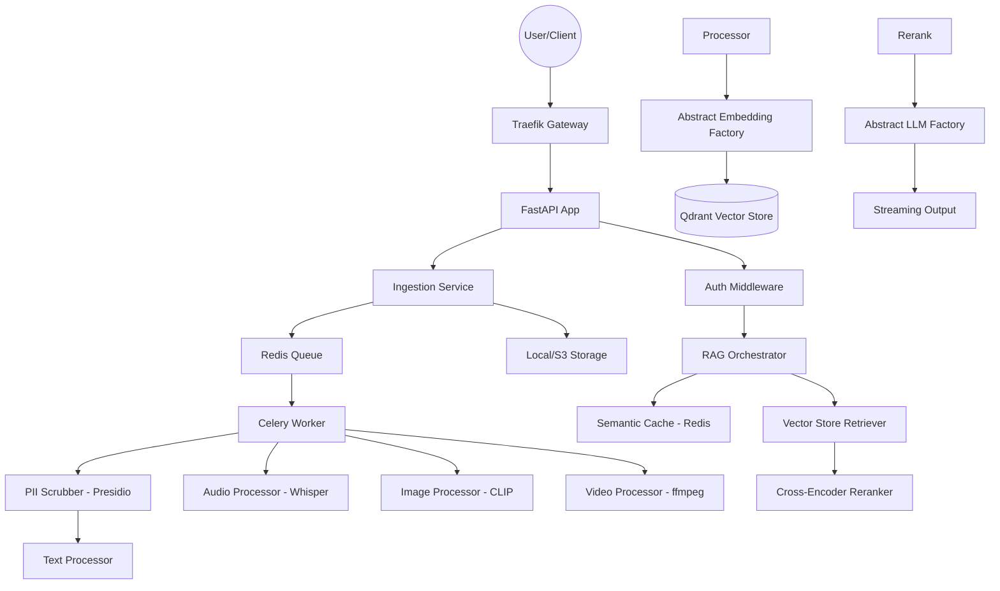

# Implementation Details - Multi-Modal RAG System

This document serves as the technical source of truth for the production-grade RAG system.

## 1. System Architecture
The system uses a **Modular Monolith** architecture with clear async boundaries via Celery.

## 2. Technical Stack & Patterns
- **Framework**: FastAPI (Async-first).
- **Design Patterns**: 
  - **Abstract Factory**: For Hotswappable LLMs and Embedders.
  - **Singleton**: For shared services like VectorStore and Cache.
  - **Middleware**: For Multi-tenancy enforcement and PII scrubbing.
- **Database**: PostgreSQL (Metadata & Audit), Qdrant (Vectors), Redis (Cache & Queue).
- **Storage**: Multi-provider (Local/AWS S3) with CloudFront distribution.

## 3. Core Features
- **Multi-modal Ingestion**: Supports extraction from diverse media via Whisper (Audio), CLIP (Images), and `ffmpeg` (Video).
- **Conversational RAG**: 
  - **Dialogue Context**: Retrieves last 10 messages from PostgreSQL to maintain chat state.
  - **Auto-Persistence**: Saves every query/response with associated reference metadata.
- **Hotswappable Providers**: Decoupled interfaces for LLMs and Embedders.
- **High-Throughput Scaling**:
  - **Async Pooling**: 50+ DB connections with overflow for high concurrency.
  - **Worker Clusters**: Prefork worker pool with concurrency tuning for media tasks.
- **Compliance**:
  - **PII Masking**: Presidio-based worker scrubbers.
  - **Audit Trails**: Non-repudiable logs for every system action.

## 4. Multi-tenancy & Administration
- **Data Isolation**: Forced `tenant_id` filtering in Qdrant and PostgreSQL.
- **Admin Module**: Secured via HTTP Basic Auth for tenant onboarding and lifecycle management.

## 5. Deployment & Orchestration
- **API Gateway**: Traefik with SSL (80/443 redirect), Rate Limiting, and ForwardAuth.
- **Helm Chart**: Production Kubernetes deployment with HPAs (Horizontal Pod Autoscalers) and resource constraints.
