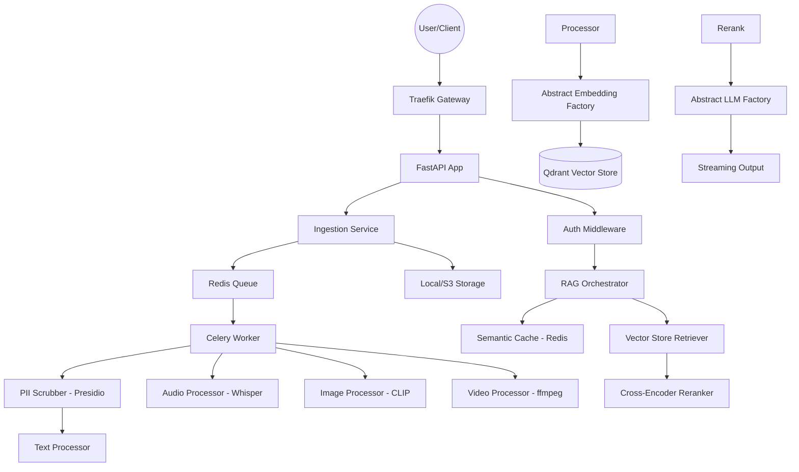

# Implementation Details - Multi-Modal RAG System

This document serves as the technical source of truth for the production-grade RAG system.

## 1. System Architecture
The system uses a **Modular Monolith** architecture with clear async boundaries via Celery.

## 2. Technical Stack & Patterns
- **Framework**: FastAPI (Async-first).
- **Design Patterns**: 
  - **Abstract Factory**: For Hotswappable LLMs and Embedders.
  - **Singleton**: For shared services like VectorStore and Cache.
  - **Middleware**: For Multi-tenancy enforcement and PII scrubbing.
- **Database**: PostgreSQL (Metadata & Audit), Qdrant (Vectors).
- **Messaging**: Redis + Celery.

## 3. Core Features
- **Multi-modal Ingestion**: Supports extraction from diverse media. Video is handled via `ffmpeg` keyframe extraction and audio segmenting.
- **Hotswappable Providers**: Define any new provider by inheriting from `BaseLLM` or `BaseEmbedder`.
- **Latency Optimization**: 
  - **Semantic Cache**: Resolves frequent queries in O(1) time.
  - **HNSW Filtering**: Tenant-ID filtering is done at the index level in Qdrant.
- **Compliance**:
  - **PII Masking**: Integrated into the ingestion worker to ensure no sensitive data is indexed.
  - **Audit Trails**: Every retrieval and ingestion action is logged to `audit_logs` table.

## 4. Multi-tenancy Isolation
- **Metadata Filtering**: Every vector has a mandatory `tenant_id` payload.
- **Query Restriction**: The `VectorStore.search` method enforces a `must` match filter on `tenant_id`.

## 5. Deployment
- **API Gateway**: Traefik handles SSL, Rate-Limiting, and Dynamic Routing.
- **Docker**: Balanced compose setup for local dev, extendable to K8s.
