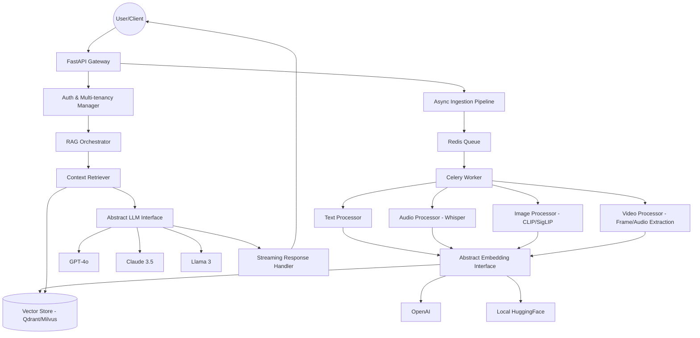

# Implementation Details - Multi-Modal RAG System

This document serves as the technical source of truth for the production-grade RAG system.

## 1. System Architecture

## 2. Technical Stack
- **Framework**: FastAPI (Async, Type-safe)
- **Metastore**: PostgreSQL (Multi-tenant, Audit logs)
- **Vector DB**: Qdrant (HNSW, Metadata filtering)
- **Cache**: Redis (Semantic cache, Session memory)
- **Task Queue**: Celery + RabbitMQ
- **API Gateway**: Traefik (Dynamic routing, Rate limiting)

## 3. Core Features
- **Multi-modal Ingestion**: Supports Text, Audio (Whisper), Image (CLIP), and Video (Frame extraction + ASR).
- **Hotswappable Providers**: Abstract interfaces for LLMs and Embedding models.
- **Ultra-Low Latency**: Semantic caching, connection pooling, and HNSW optimization.
- **Multi-tenancy**: Strict metadata-level isolation.
- **Advanced RAG**: Semantic Reranking (2-stage), Parent-Document Retrieval, and HyDE.
- **Togglable Evaluation**: Redis-managed accuracy evaluation (Shadow logging, RAGAS scoring).

## 4. Compliance (SOC2 & GDPR)
- **Encryption**: AES-256 (Rest), TLS 1.3 (Transit).
- **PII Scrubbing**: Integrated middleware via Presidio.
- **Right to be Forgotten**: Async data wiping jobs.
- **Audit Logs**: Immutable logs for all data access.

## 5. Deployment
- **Containerization**: Docker-first approach.
- **Orchestration**: Kubernetes (Helm charts) for production.
- **GPU support**: Pinned workers for model-intensive tasks.
